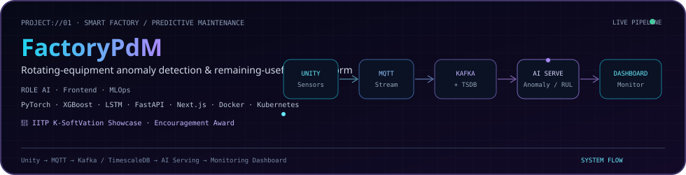
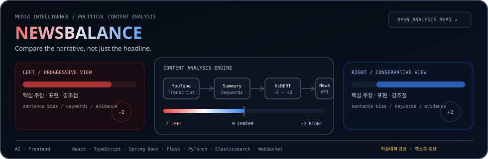
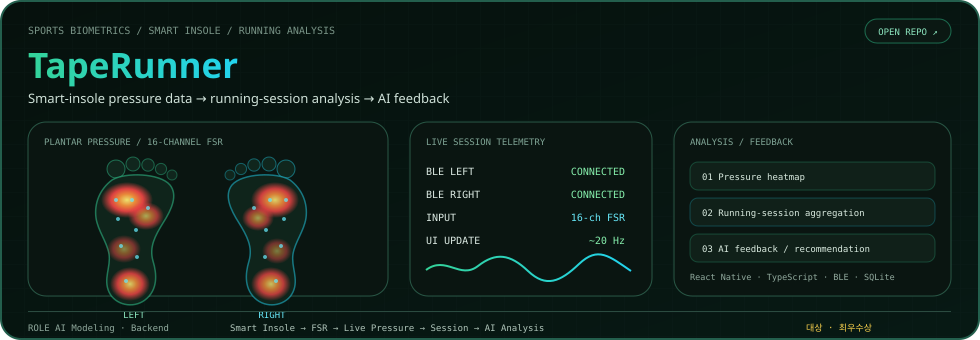
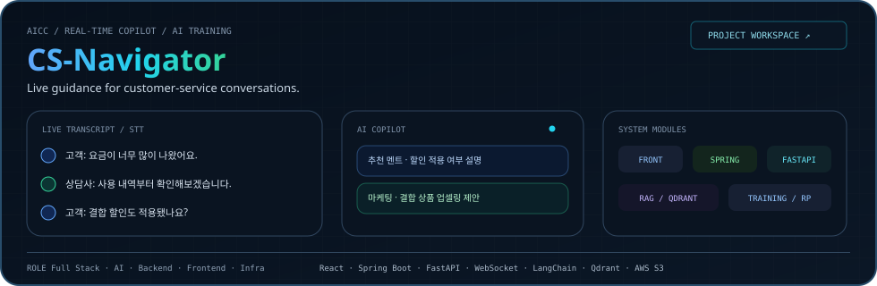

<!-- =========================
     NAME BADGE
========================= -->

  

<!-- =========================
     HEADER / NAV
========================= -->

  ### 👋 Backend & AI Developer  
  `Server · Data · Infrastructure`

  데이터와 AI로 문제를 정의하고, 안정적인 서버와 인프라로 해결하는 백엔드/AI 개발자입니다.

   

  <a href="#projects">📂 Projects</a> ·
  <a href="#certifications">🎓 Certifications</a> ·
  <a href="#achievements">🏅 Achievements</a> ·
  <a href="#github-stats">📊 Stats</a>

---

<!-- =========================
     FLAGSHIP PROJECTS
========================= -->

## 🚀 Flagship Projects

 

  

  

  

  

  

  

  
   
  
    <a href="https://github.com/twelevegg/Front">Frontend</a>
    &nbsp;·&nbsp;
    <a href="https://github.com/twelevegg/spring">Spring Backend</a>
    &nbsp;·&nbsp;
    <a href="https://github.com/twelevegg/fastapi">FastAPI / AI</a>
  

 

---

<!-- =========================
     CERTIFICATIONS
========================= -->

## 🎓 Professional Certifications

  
   
  Click the certification panel to view verification documents.

 

---

<!-- =========================
     ACHIEVEMENTS
========================= -->

## 🏅 Achievements

### 🧑‍🎓 Academic Awards

  

    🥇 <b>금상</b> · <b>2025.06.13</b> | 한국정보기술학회 하계종합학술대회 
    정치 유튜브 콘텐츠 편향도·정확도 분석 AI  
    🥈 <b>은상</b> · <b>2024.11.22</b> | 한국정보기술학회 추계종합학술대회 
    블록체인 기반 분산형 응급의료 지원  
    🥈 <b>은상</b> · <b>2024.05.24</b> | 한국정보기술학회 하계종합학술대회 
    시각 장애인 분리수거 도움 시스템
  

---

### 🏆 Competitions

  

    🏆 <b>대상</b> · <b>2025</b> | AI-Powered SW상상기업 경진대회 
    TAPE · 센서 기반 AI 러닝 헬스케어  
    🏆 <b>최우수상</b> · <b>2025</b> | SW중심대학 연합 SW FESTIVAL 
    TAPE · 센서 기반 AI 러닝 헬스케어  
    🏅 <b>장려상</b> · <b>2025</b> | 정보통신기획평가원(IITP) 주관 K-SoftVation Showcase 
    FactoryPdM · 회전 설비 예지보전  
    🥈 <b>은상</b> · <b>2025</b> | 산학협력 캡스톤디자인 경진대회 
    NEWSBALANCE · 정치 콘텐츠 편향도·정확도
  

<!-- =========================
     GITHUB STATS
========================= -->

## 📊 GitHub Stats

<b>Show Stats (접기/펼치기)</b>

  

